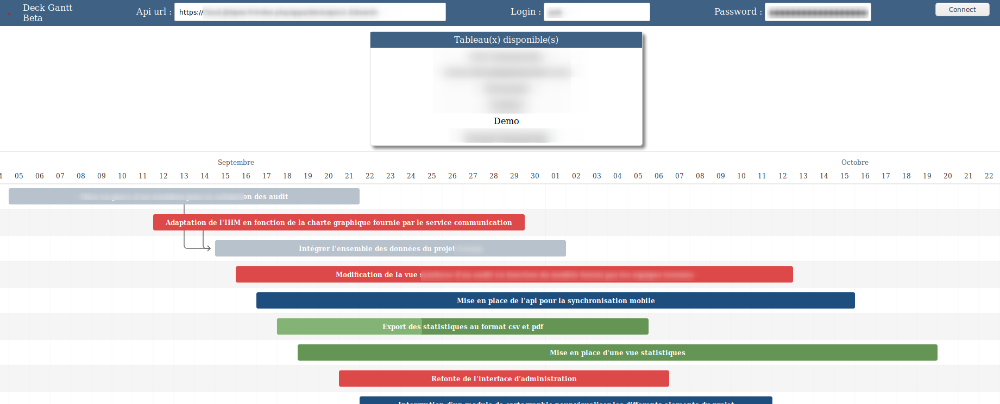

# deckGantt
Simple web interface using FrappeGantt to show Nextcloud Deck Board cards in gantt format 

Thanks to : 

https://github.com/nextcloud/deck

https://github.com/frappe/gantt

## WARNING

It's really a beta version

Chart interactivity will add some values to your card description to set fields as duration, progression ...

We don't guarantee the online service demo availability

## USAGE

Online demo version :

https://deckgantt.jblopez.fr/

Api url  : your nextcloud deck api url like https://mynexcloud.xy/index.php/apps/deck/api/v1.0/boards

Login : your login 

Password :  you can create dedicated password for this app in nextcloud in  profil->security 

## SelfHosted :

Just clone and publish.

## How it works :

#### **To see task/card in gantt chart you must set the deck card field due date at least** 

For the moment deck don't have duration, progression, and dependencies card fields... 

So you can had tags in card description to set them :

<u>Exemple :</u> 

**d:8:d** // --> task/card  duration in day  (can be set and update directly from chart )

**p:60:p** // --> task/card progression in percent  (must be initialize here but can be update from chart )

**w:15,54,12:w**  // -->  comma separated ids of card dependencies ( can be set only from  here for the moment )

**c:bar-blue:c** // --> css class of bar in chart can be customized/extended in includes/deckGantt.css. By default 4 classes are available **bar-blue bar-red bar-green and bar-default** ( can be define only from here for the moment )

Hope this useful !